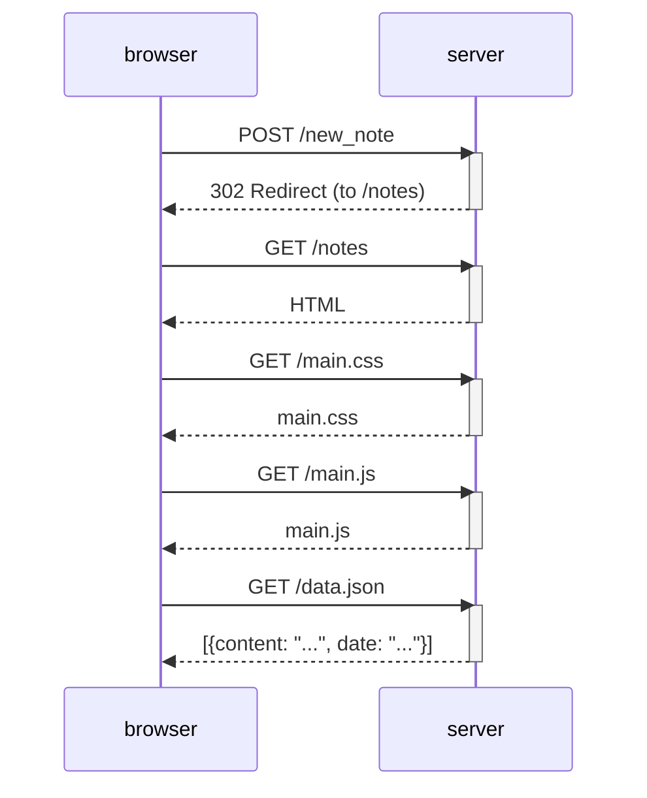

# Diagram 0.4

```mermaid
sequenceDiagram
    participant browser
    participant server

    browser->>server: POST /new_note
    activate server
    server-->>browser: 302 Redirect (to /notes)
    deactivate server

    browser->>server: GET /notes
    activate server
    server-->>browser: HTML
    deactivate server

    browser->>server: GET /main.css
    activate server
    server-->>browser: main.css
    deactivate server

    browser->>server: GET /main.js
    activate server
    server-->>browser: main.js
    deactivate server

    browser->>server: GET /data.json
    activate server
    server-->>browser: [{content: "...", date: "..."}]
    deactivate server
```
