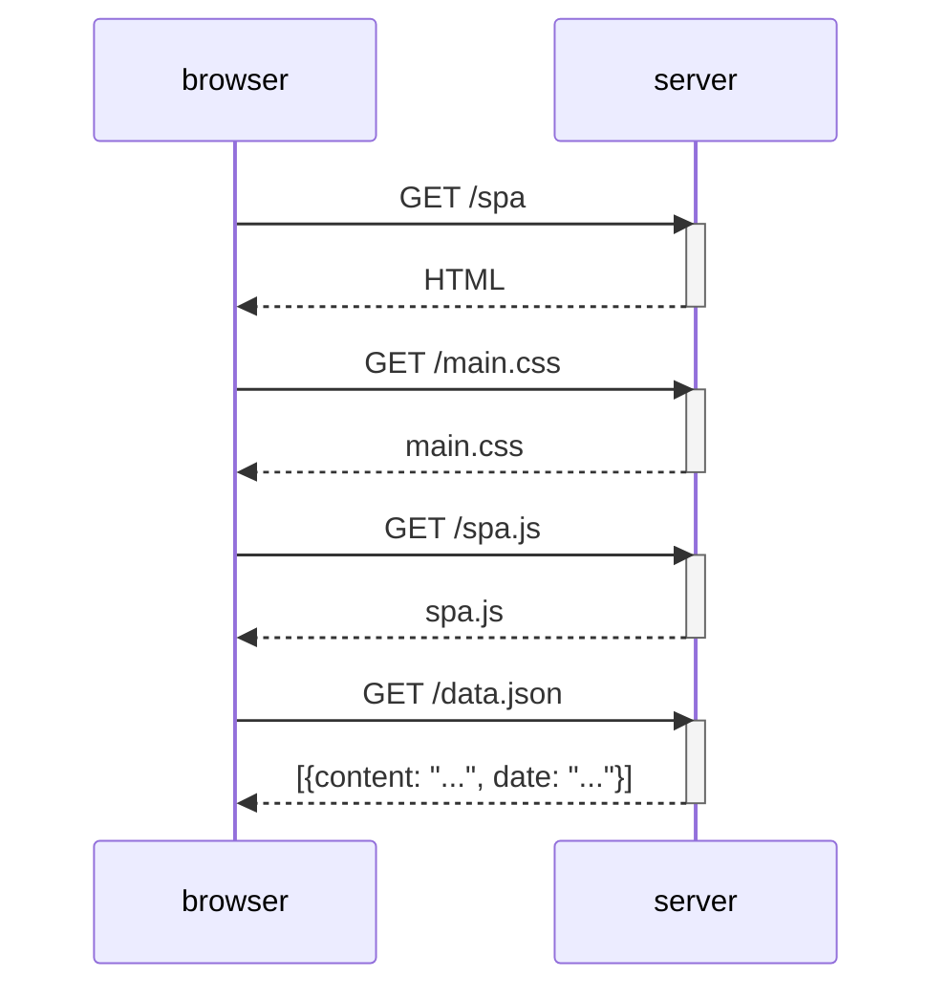

# Diagram 0.5

```mermaid
    sequenceDiagram
    participant browser
    participant server

    browser->>server: GET /spa
    activate server
    server-->>browser: HTML
    deactivate server

    browser->>server: GET /main.css
    activate server
    server-->>browser: main.css
    deactivate server

    browser->>server: GET /spa.js
    activate server
    server-->>browser: spa.js
    deactivate server

    browser->>server: GET /data.json
    activate server
    server-->>browser: [{content: "...", date: "..."}]
    deactivate server
```
